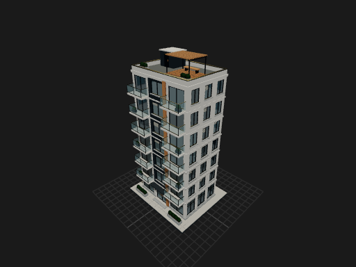
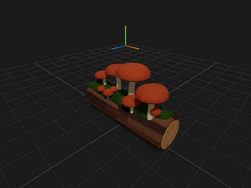
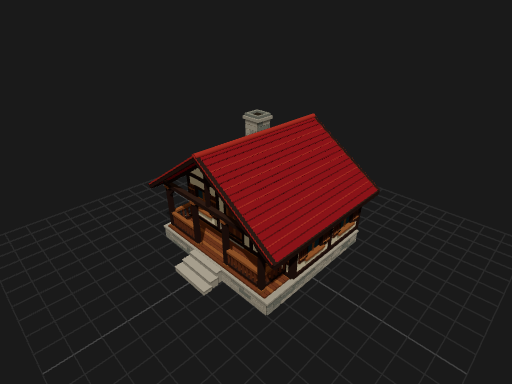

# ThreeJS Generator

Turn text into editable Three.js. Export as GLB.

A local, open-source workbench for generating 3D assets with an OpenAI or Anthropic model. The result is JavaScript you can inspect and edit—not just a mesh. Ask for editable controls, adjust the asset locally, and export it to Blender or your own Three.js project.

## Video demo

A two-minute walkthrough of the generator and both included demos. 4K, no audio.

https://github.com/user-attachments/assets/547f7ee0-b832-459c-87d1-4e17de85a96c

| Park Apartments | Woodland Mushrooms | Alpine Cottage |
| --- | --- | --- |
|  |  |  |

These editable examples ship with the app. No API key is needed to try them.

## Quick start

Install Node.js 24 and use a current desktop Chrome or Edge browser. Download/extract the source or clone this repository, then open a terminal in the folder containing `package.json`:

```sh
npm ci
npm run dev
```

Open [http://127.0.0.1:5173](http://127.0.0.1:5173) and keep the terminal running. If that port is occupied, use the different URL Vite prints; each origin has separate Library/recovery storage.

1. Choose **Try an example**, or **Browse templates**, and load a generated starter.
2. Drag to orbit, scroll to zoom, and adjust its controls. These actions are local and free.
3. Choose **Save to Library** to keep a named copy, or **Download GLB** to take it into Blender.

To generate your own asset, open **Connect a model** or **Model settings**, select a provider/model, enter its API key, and save. Then describe your asset and select **Generate**.

**AI requests are billed directly by your API provider.** ChatGPT/Claude subscriptions do not include API usage. A configured key indicator is not a paid connection test or a guarantee of model access. No `.env` file is required for browser-entered session keys; optional persistent server configuration is explained in the [user guide](docs/USER_GUIDE.md#models-keys-and-costs).

## What you can do

- Generate custom `createAsset()` code, inspect it, or apply an **AI Edit**.
- **Add editable controls**, optionally describing what should be adjustable—floor count, roof pitch, foliage density, colors, and more. Subsequent slider edits need no AI request.
- Save assets with their seed, parameters and textures. Local recovery protects the last working asset and unapplied code draft; Library JSON backups move saved assets between computers.
- Download an editable `.js` preset or a static `.glb` scene. **Copy source** deliberately copies only the function, not its saved inputs.
- Arrange repeated assets, compare an automatically optimized layout, and download that layout as GLB. Optimization makes no API call and does not simplify geometry.

The app preserves the last working asset when a generation or edit fails. Generated code is executed in an isolated browser worker; geometry hints are advisory, not extra AI rejection rounds.

## Try the demos

[Snack Abduction](demos/snack-abduction/README.md) turns seven exported JavaScript assets into a playable tabletop UFO game. It imports the generated source directly: the saucer's emitter glows, the robot's brushes spin, and generated snacks become things you can pick up and score with. No GLBs or API key are needed to play.

From the repository root:

```sh
npm --prefix demos/snack-abduction ci
npm run demo:snack-abduction
```

Open [http://127.0.0.1:5174](http://127.0.0.1:5174).

[Little Borough](demos/little-borough/README.md) is a relaxed city planner made from six exported JavaScript assets. Click to add apartment floors, right-click to remove them, and build a colorful neighborhood around a park. Floor changes regenerate real geometry; cars, vans and trees show off the exports' procedural variations.

```sh
npm --prefix demos/little-borough ci
npm run demo:little-borough
```

Open [http://127.0.0.1:5175](http://127.0.0.1:5175). Both demos have their own dependencies and builds, so they can run alongside the generator. Neither needs an API key. See [demos](demos/README.md) for the source and checks.

## Learn more

- [User guide](docs/USER_GUIDE.md): keys, costs, controls, saving/recovery, imports, exports, batching and troubleshooting.
- [Development](docs/DEVELOPMENT.md): commands, tests, contribution conventions and local API integration.
- [Architecture](docs/TECHNICAL_OVERVIEW.md) and [runtime safety](docs/ISOLATED_RUNTIME.md).
- [Changelog](CHANGELOG.md) and [release checklist](docs/RELEASING.md).

To run a production build locally:

```sh
npm run build
npm start
```

Open [http://127.0.0.1:4173](http://127.0.0.1:4173). A static file host alone is not enough; the local Node server provides the model API. Browser storage is tied to the origin, so development and production ports have separate libraries and recovery copies.

## Scope and limitations

This is a **local desktop-browser tool**, not a multi-user hosted service. AI geometry can contain intersections, missing details, or inefficient construction; inspect results before use. Runtime JavaScript animation exports as a static GLB snapshot. Optimized GLB uses instancing, whose handling varies between importers. Isolation reduces access to the app and network but cannot guarantee protection from excessive GPU/memory use or browser bugs. Only import code you trust.

There is no local-model inference backend. Model IDs are configurable; available models and API prices depend on your provider account. The built-in examples work without provider access.

## License

[MIT](LICENSE), copyright © 2026 Gary Smith. Third-party components retain their own licenses; see [third-party notices](public/THIRD_PARTY_NOTICES.txt). Built copies also include generated dependency licenses and supplemental notices.
