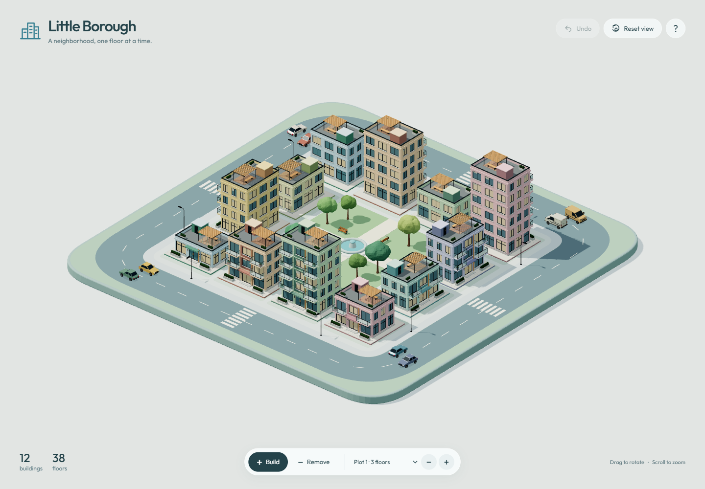

# Little Borough

A relaxed neighborhood planner made from six JavaScript exports from **ThreeJS Generator**. Add a floor, take one away, and watch a little city grow around its park.



## Run locally

Node.js 24 is recommended, matching the generator. From the repository root, in PowerShell:

```powershell
cd demos/little-borough
npm.cmd ci
npm.cmd run dev
```

Open [http://127.0.0.1:5175/](http://127.0.0.1:5175/). The development server uses a strict port so it won't silently move to another demo's address. Stop an existing copy before starting another on port 5175. After installing this demo's dependencies, you can also launch it with `npm run demo:little-borough` from the repository root.

## Controls

| Action | Control |
| --- | --- |
| Create a building / add one floor | Left-click a plot or building |
| Remove a floor / remove a one-floor building | Right-click |
| Rotate | Drag |
| Pan | Shift-drag or right-drag |
| Zoom | Scroll |
| Undo | Undo button or Ctrl/Cmd+Z |
| Restore the camera | Reset view |

On touch screens, choose Build or Remove, then tap; use two fingers to pan and zoom. The plot menu and plus/minus buttons provide keyboard controls. Reduced motion disables dust, building bounce, and moving traffic.

The twelve plots start empty. Buildings range from one to ten floors and keep their palette and seed during floor edits. New buildings receive a random coordinated palette. The city saves in this browser, with up to fifty undo steps for the current visit.

## Where the generated code is used

The six original `.js` exports are unchanged. `src/scene.js` imports their `createSavedAsset` factories directly:

- **Apartment:** `floorCount`, five material colors, and a stable seed. Changing floors rebuilds real geometry; only the brief transition uses scaling. Windows are set to opaque for this exterior scene.
- **Hatchback and van:** paint and wheel variations, with named wheel groups turning as vehicles follow smooth road loops.
- **Tree:** varied seeds, height, crown width, foliage count, and green tones.
- **Streetlight and bench:** repeated static exports.

Roads, plots, fountain, lighting, animation and interaction are ordinary Three.js scene code. No GLBs, runtime code evaluation, model downloads, generator server, or API keys are required. Fonts are bundled locally.

The module split is small: `model.js` owns city state and save validation; `traffic.js` owns road geometry; `scene.js` owns rendering and interaction; `main.js` connects the scene and interface. Old building resources are disposed after replacement; dust uses a fixed pool.

## Verify and build

```powershell
npm.cmd test
npm.cmd exec playwright install chromium
npm.cmd run test:browser
npm.cmd run build
npm.cmd run preview
```

Run these checks from `demos/little-borough`. Browser tests start their own server on port 5200, exercise real pointer input and touch controls, and don't reuse the demo server. The generator's browser tests use 5198; Snack Abduction uses 5199.

Production output is in this demo's `dist/` folder, with relative asset paths for hosting in a subdirectory. The production preview uses [http://127.0.0.1:4175/](http://127.0.0.1:4175/). Vite emits a bundle-size advisory because Three.js and all six factories are bundled together; the initial JavaScript compresses to about 196 kB. The generator's root build does not include this demo.

This demo is covered by the repository's [MIT license](../../LICENSE). Three.js stays at **0.169.0**, matching the generator exports. Outfit is distributed under the SIL Open Font License through Fontsource. [Third-party notices](public/THIRD_PARTY_NOTICES.txt), the font license and generated JavaScript dependency notices are included in the static build.
